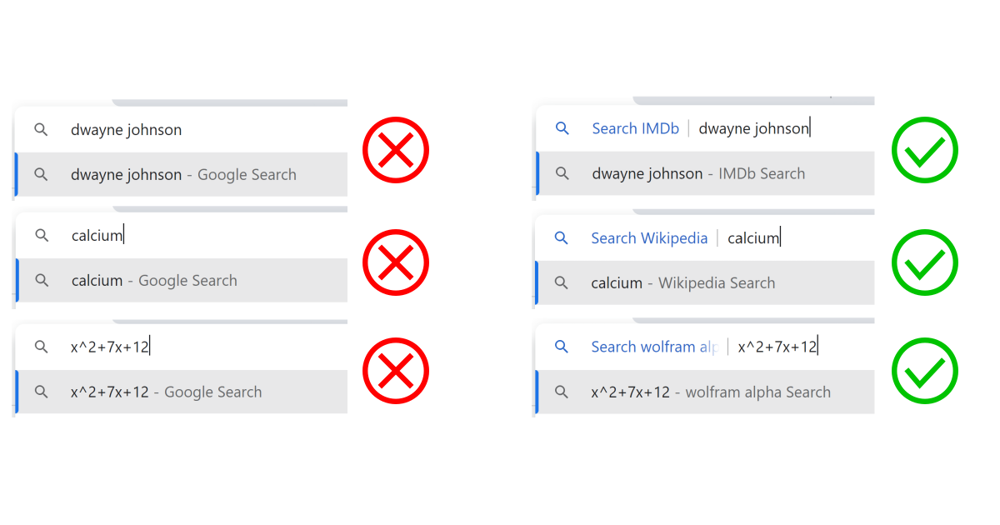
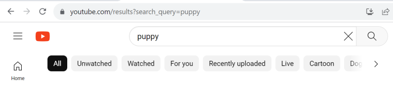
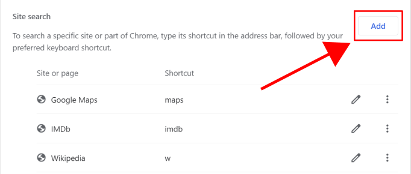
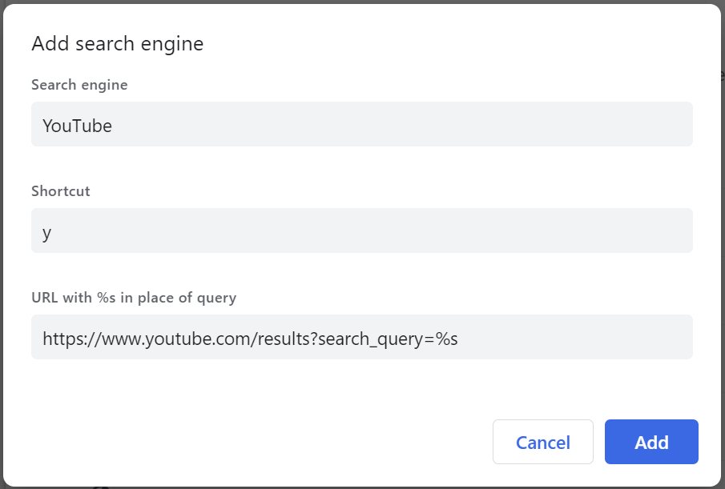
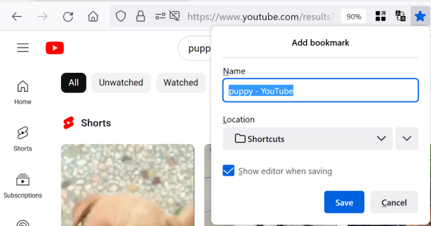
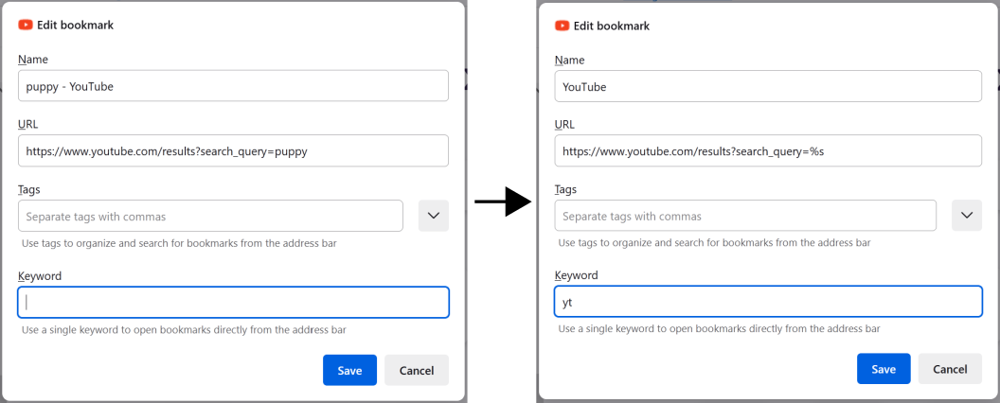

If you google something and notice that half the time, you always click on the same website among the search results, you could have been better off searching on that site from the beginning. This blog post will go through how to speed up your future searches where you know from the beginning which website you want to go to.

<!-- end excerp -->

For example, if you're always looking up facts about things, you could get straight to Wikipedia. If you're learning a language, you might want to get to bab.la for translations or if you're working with a new programming framework, Stack Overflow could be your target instead.

After just a couple of minutes of setup, you can easily get there by typing one or a few extra letters before the search term, such as "w" for Wikipedia, "b" for bab.la and "sof" for Stack Overflow respectively, which some example searches being `w united states senate`, `b esperanza` and `sof copy object in javascript`.

## Adding shortcuts

The method of adding the shortcut differs between browsers, so here are the steps for Google Chrome and Firefox. If you're using another chromium-based browser, like Microsoft Edge or Opera, the steps should be similar to Chrome.

### Google Chrome

**The first step** is to add the website as search option. Enter Settings -> "Search engine" -> "Manage search engines and site search". If you previously have visited the website and you're lucky with how it's configured, you might find it at the bottom of the page, under the "Inactive shortcuts" heading (you might need to press "Additional inactive sites" to find it). Simply press "Activate", find it among the added sites (again, you might need to press "Additional sites" to see it), press the pen icon and you're can move on to the next step.

If the website is not present, it's still easy to add. Just go to the website you want to add and search for any term. As an example, I'll search for "puppy" on YouTube (even though YouTube actually was detected automatically). What you need to do is to copy the URL in which the search results are, in this case `https://www.youtube.com/results?search_query=puppy`.

Going back to the settings page, press "Add" by the second heading "Site search".

Paste the URL in the third field "URL with %s in place of query" and replace the query you used with a `%s`. This tells the browser where the search text should go, and in the example from before, we get the URL `https://www.youtube.com/results?search_query=%s`. Note that depending on the specific URL, the query may be in the middle of the URL instead of the end. In that case, make sure to replace only the original search query with `%s` and keep everything before and after as it was.

**The second step** is to customize which shortcut keyword you want. If the website was automatically detected by the browser, the field "Shourtcut" will be already filled in, but you can go ahead and clear it.

What you want to write instead is something very short and easy to remember, preferably the first letter of the website. In the case of YouTube, I would pick `yt` simply because it feels like a natural abbreviation for me, but you might prefer just `y`. And that's it, you can now hit "Save"! In order to search for something on YouTube, you only have to write `yt` (or whatever your chosen shortcut is) first in the adress bar.

Finally, just add the name of the website in the field "Search engine" and press the "Add" button (or "Save", if you had added it automatially).

### Firefox

Firefox, like Chrome, has an autodetect function for adding search on specific sites. However, I will go through the manual way, as it is more versatile and will also get synced if you have a firefox account.

Start by heading to the website you want to add and search for any term. I'll use the same example as in the steps for Chrome above and search for "puppy" on YouTube. Bookmark the page in which the search results are, preferably in a new folder called "Shortcuts" or something similar, and in this case the URL is `https://www.youtube.com/results?search_query=puppy`.

After saving, find the bookmark, right-click it and finally press "Edit Bookmark...". In the second field, `URL`, replace the query you used with a `%s`. This tells the browser where the search text should go, and in the example from before, we get the URL `https://www.youtube.com/results?search_query=%s`. Note that depending on the specific URL, the query may be in the middle of the URL instead of the end. In that case, make sure to replace only the original search query with `%s` and keep everything before and after as it was.

In the `"Keyword"` field, you want to write something very short and easy to remember, preferably the first letter of the website. In the case of YouTube, I would pick `yt` simply because it feels like a natural abbreviation for me, but you might prefer just `y`. And that's it, you can now hit "Save"! In order to search for something on YouTube, you only have to write `yt` (or whatever your chosen shortcut is) first in the adress bar. As a final cleanup, you can also trim the "Name" field to only contain the websites name.

## A couple of recommendations

* **Don't** use a letter or abbreviation that also is a real word as a shortcut. If you choose e.g. `i` to search on Instagram, the phrase `i have a headache` would search for `have a headache` on Instagram instead of googling the full phrase. This is also why I used `sof` instead of `so` as shortcut for Stack Overflow in the example.
* Make sure the shortcuts feel logical for you, so that they are easer to remember, and start of with just a few often used websites. It's tempting to have a shortcut for each letter in the alphabet, but if you can't easily remember the shortcut, then there's no time saved. Personally, I have the complete word `maps` as the shortcut to Google Maps, simply because there was not a strong enough link in my mind between the single letter "m" and the name of the service.
* Here are some websites you can use it for to use it on and suggestions for the keyword:
    * `w` for Wikipedia
    * `m` or `maps` for Google Maps
    * `y` or `yt` for YouTube
    * `az` for Amazon
    * `s` or `sof` for Stack Overflow
    * `s` for Spotify (given that you've chosen another keyword for Stack Overflow)
    * `t` for Google Translate
    * `g` or `gm` for searching your Gmail inbox
    * `imdb` for IMDB
    * your favorite Fandom wiki
    Of course, you can always replace these specific ones with other services that you prefer, such as Apple Music instead of Spotify.

## Conclusion

With this method, your searches will be faster than ever! And if you find that you regularly search for things in a new website, it can easily be added following the same steps. I hope you have learned to utilize and appreciate this lesser known, but quite handy feature of modern web browser.