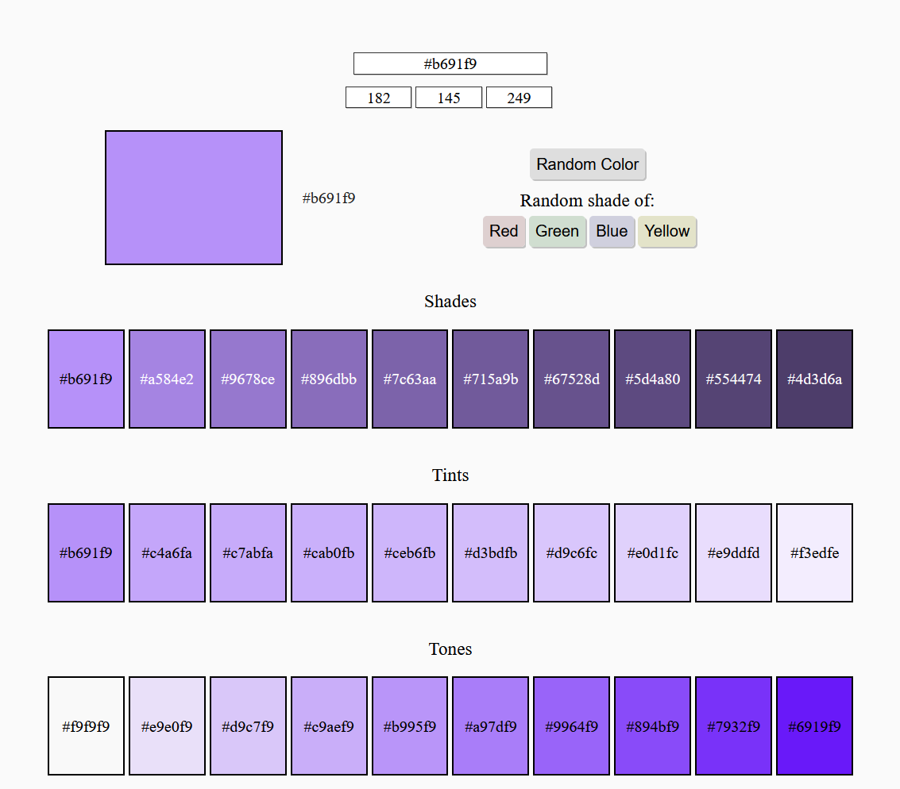

**Color Codes** is a color hex code browsing website. The website can be found <a href="https://color-codes.onrender.com/" target='_blank' rel='noopener noreferrer'>here</a> and the source code is available on <a href="https://github.com/arvidsandin/color-codes" target='_blank' rel='noopener noreferrer'>Github</a>

