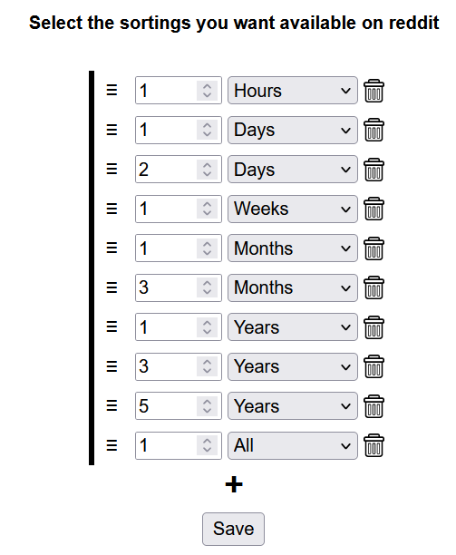
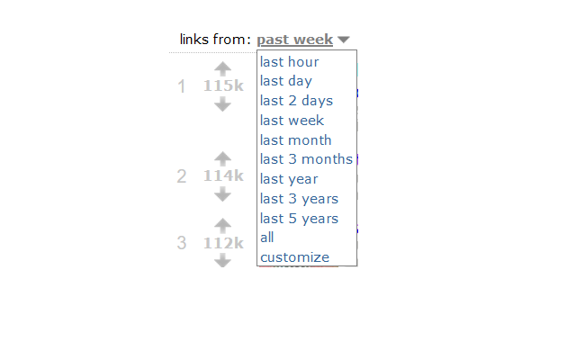

**Custom top sort for Reddit** is a browser extension to get the top posts on Reddit with other options than the default last hour, day, week, month and year. With the extension, it can be filtered and sorted from the last three days, 21 hours, 7 months or whatever you want! Custom top sort currently has **300+ weekly users**. Due to an update on Reddit's part, this extension stopped working with their redesign and I've been unable to find a workaround. It is however fully functional when using [old.reddit.com](http://old.reddit.com) to browse.

The extension is available for <a href="https://addons.mozilla.org/addon/custom-top-sort-for-reddit/" target='_blank' rel='noopener noreferrer'>Firefox</a>,
<a href="https://chrome.google.com/webstore/detail/custom-top-sort-for-reddi/ppcdmieefbelokaacilcciackbocjghj" target='_blank' rel='noopener noreferrer'>Google Chrome</a>
and
<a href="https://microsoftedge.microsoft.com/addons/detail/mkcacimdeiebnabgpikngeneojbeeafc" target='_blank' rel='noopener noreferrer'>Microsoft Edge</a>.
The source code is available on <a href="https://github.com/arvidsandin/custom-top-sort-for-reddit" target='_blank' rel='noopener noreferrer'>Github</a>.

