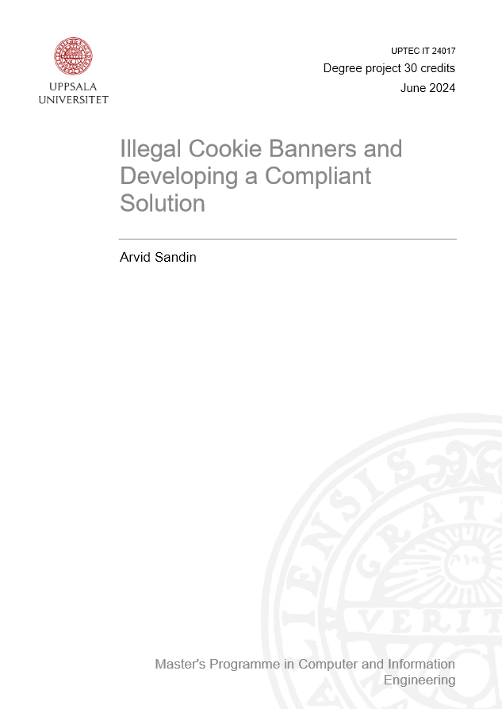

*Illegal Cookie Banners and Developing a Compliant Solution* is my Master's Thesis. In it I investigate the legal requirements of cookie banners in the EU according to the GDPR. The most important finding is that **nearly all websites uses non-compliant cookie banners**. The report discusses how the online world ended up like this and what would be required to fix this.

The report is published by Uppsala University and is freely available to download from [DiVA](http://urn.kb.se/resolve?urn=urn:nbn:se:uu:diva-530626).

 

### Abstract
*Laws in the European Union can be difficult to interpret and the General Data Protection Regulation (GDPR) has majorly redefined consent in regard to online tracking. By specifying requirements for a cookie banner, the compliance of different websites can easier be investigated and a compliant cookie banner can be created. The result shows that virtually all websites fail to collect consent in accordance with the law. A created web component, simply called cookie-banner is suggested as a compliant solution.*

