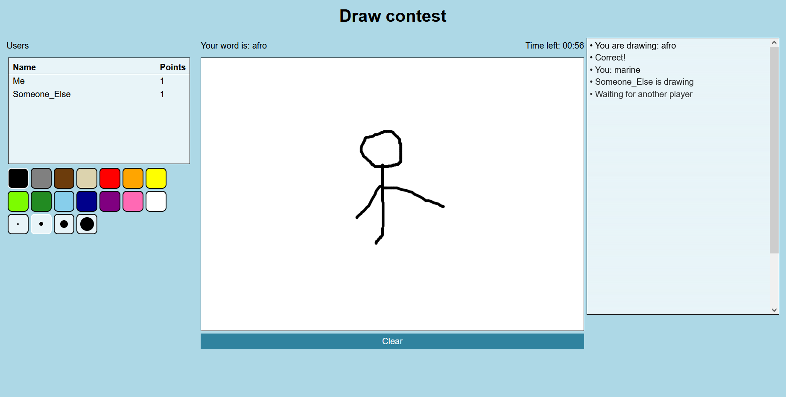

**Draw contest** is a real-time draw-and-guess game where one player tries to draw an image of something, while the others try to guess what it is. If a player guesses the correct word, both that player and the drawer gets awarded with one point each. Due to the removal of Heroku free plans in November 28, 2022, there is no longer a live version of this project. However, the source code is still available on <a href="https://github.com/arvidsandin/draw-contest" target="_blank" rel="noopener noreferrer">Github</a>

